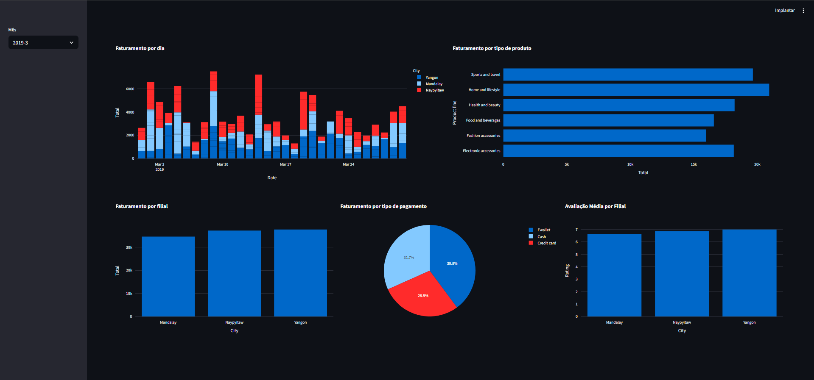

# 📊 Dashboard de Análise de Vendas com Streamlit



## 📖 Sobre o Projeto

Este projeto consiste em um dashboard interativo desenvolvido para a análise de dados de vendas de uma rede de supermercados. A aplicação permite a visualização dinâmica de métricas de faturamento, desempenho de produtos, formas de pagamento e avaliações por filial, oferecendo uma visão clara e detalhada do negócio através de filtros mensais.

O objetivo é demonstrar a aplicação prática de ferramentas de Data Science e Business Intelligence para extrair insights valiosos de dados brutos, utilizando Python e bibliotecas especializadas.

---

## ✨ Funcionalidades Principais

-   **Visão Geral do Faturamento:** Acompanhe o faturamento total por dia, com visualização segmentada por filial.
-   **Análise de Produtos:** Identifique as linhas de produto mais rentáveis em cada período.
-   **Desempenho por Filial:** Compare o faturamento total e a avaliação média entre as diferentes unidades da rede.
-   **Formas de Pagamento:** Entenda a distribuição do faturamento entre as diferentes formas de pagamento (Dinheiro, Cartão de Crédito, E-wallet).
-   **Filtro Interativo:** Selecione o mês desejado para analisar os dados de um período específico, tornando a exploração dos dados mais flexível e focada.

---

## 🛠️ Tecnologias Utilizadas

O projeto foi construído utilizando as seguintes tecnologias:

-   **Python:** Linguagem principal para a manipulação dos dados e desenvolvimento da aplicação.
-   **Streamlit:** Framework utilizado para a criação e publicação do dashboard interativo.
-   **Pandas:** Biblioteca para leitura, tratamento e manipulação dos dados.
-   **Plotly Express:** Biblioteca para a criação dos gráficos interativos e visualmente atraentes.

---

## 🚀 Como Executar o Projeto

Para executar este projeto localmente, siga os passos abaixo.

### **Pré-requisitos**

-   Ter o [Python 3.8+](https://www.python.org/downloads/) instalado em sua máquina.
-   Ter o [Git](https://git-scm.com/downloads) instalado para clonar o repositório.

### **Passo a Passo**

1.  **Clone o repositório:**
    ```bash
    git clone [https://github.com/seu-usuario/seu-repositorio.git](https://github.com/seu-usuario/seu-repositorio.git)
    cd seu-repositorio
    ```

2.  **Crie um ambiente virtual (Recomendado):**
    ```bash
    python -m venv venv
    ```
    -   Para ativar no Windows:
        ```bash
        .\venv\Scripts\activate
        ```
    -   Para ativar no macOS/Linux:
        ```bash
        source venv/bin/activate
        ```

3.  **Instale as dependências:**
    O projeto utiliza um arquivo `requirements.txt` para gerenciar as bibliotecas. Instale-as com o comando:
    ```bash
    pip install -r requirements.txt
    ```
    > **Nota:** Se você ainda não criou o arquivo `requirements.txt`, gere-o com o comando:
    > `pip freeze > requirements.txt`

4.  **Execute a aplicação Streamlit:**
    ```bash
    streamlit run dashboards.py
    ```

Pronto! A aplicação será aberta automaticamente no seu navegador padrão.

---

## 📄 Dados

O conjunto de dados utilizado neste projeto é o **"Supermarket Sales"**, disponível publicamente no Kaggle. Ele contém informações detalhadas sobre vendas em 3 filiais diferentes de um supermercado em um período de 3 meses.

-   **Fonte:** [Supermarket Sales no Kaggle](https://www.kaggle.com/datasets/aungpyaeap/supermarket-sales)
